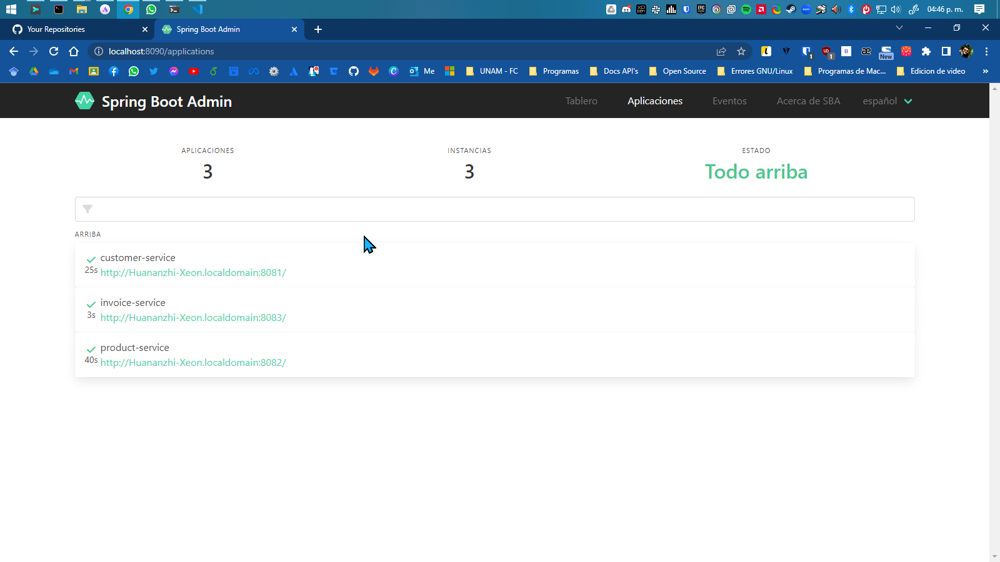
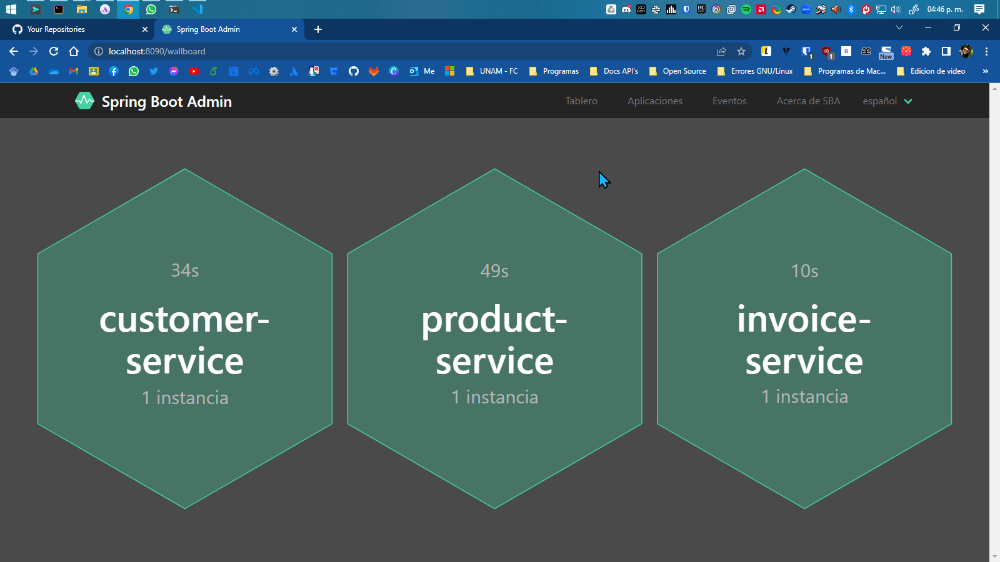
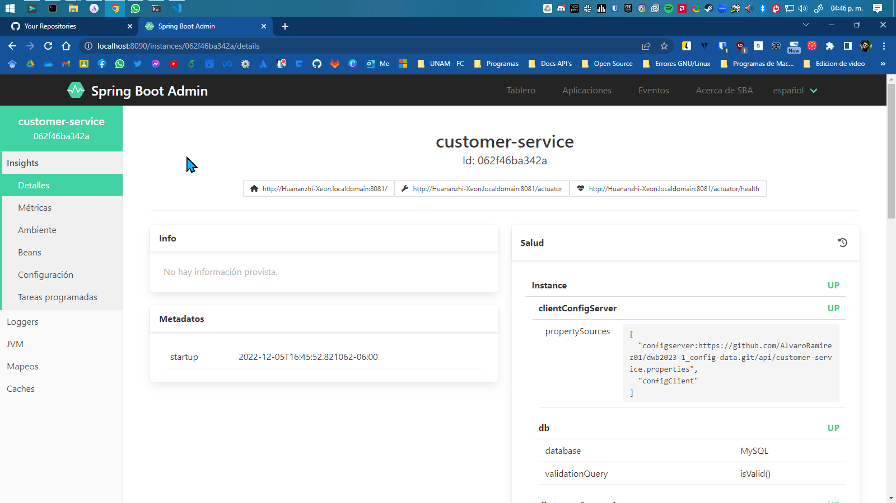
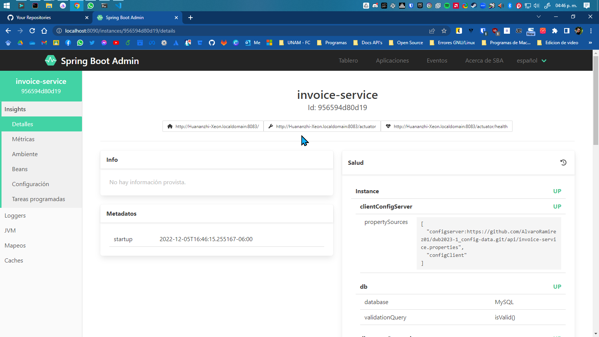

# Desarrollo Web Backend 2023-1

## Profesor:

Jesús Iván Saavedra Martínez

## Ayudantes:

Fernando Antonio Sánchez Montoya

Carlos López Rodriguez

## Ayudantes de Laboratorio:

Carlos López Rodríguez

Ilse Gisela Suárez Peña

## Integrantes del equipo

Francisco Contreras Ibarra

Alvaro Ramirez Lopez

## Descripción general

Durante el curso se han desarrollado un par de APIs para gestionar la información de clientes y productos. Asimismo, se ha implementado la estructura de la arquitectura de microservicios. En este proyecto se implementaran funcionalidades faltantes de una API que administra la información de facturas de clientes cuando compran productos .

Desarrolla la siguiente lista de requerimientos:

1. Crea un proyecto de Spring con lo siguiente:

   * Maven Project, Spring Boot 2.7.5*, Group: com, Artifact: invoice, Packaging: Jar, Java: 11
   * Agrega las dependencias necesarias de acuerdo con el requerimiento 2
   * Agrega a tu proyecto las clases del archivo  "Proyecto InvoiceModule.zip" en los paquetes correspondientes (Controller, Service, etc.)
2. Integra la API Product y la API generada en el requerimiento 1 a la arquitectura de microservicios desarrollada a partir de la semana 10 del curso, la cual tiene integrada la API Customer.

   * La configuración de los servicios debe ser gestionada por el config-service
   * Deben ser registrados en el servidor de eureka
   * Deben ser monitorizados por el admin-service
   * Cualquier petición a las APIs debe realizarse por el gateway-service
3. Actualmente el método addToCart del Servicio Cart valida con la API Customer si el RFC del cliente es valido. Sin embargo, no tiene implementada la validación con la API Product si el GTIN del producto es valido y si se cuenta con el stock suficiente para agregar el producto al carrito.

   * Actualiza el DtoProduct agregando los atributos de clase necesarios para las validaciones
   * Actualiza el método getProduct de la interfaz ProductClient (en el paquete config.client) para que recupere la información necesaria de la API Product
   * Actualiza el SvcCartImp para que valide que el GTIN del producto exista. Si existe, asignar el stock del producto a una variable llamada product stock. Si el producto no existe enviar una excepción con el mensaje "product does not exist"
4. ¿Que pasa si se desea agregar un producto que ya existe en el carrito? En lugar de registrarlo nuevamente, solo se debería actualizar la cantidad del producto en el carrito. Actualiza el SvcCartImp para que valide si el producto ya había sido agregado en el carrito:

   * Si ya había sido agregado, validar que las cantidades (quantity nueva + quantity ya agregada) no superen el stock disponible del producto
   * Si la cantidad total no supera el stock entonces se debe actualizar la cantidad previamente registrada, terminar la ejecución del método y enviar el ApiResponse ”quantity updated”
   * Si la cantidad total supera el stock se debe enviar una excepción con el mensaje ”invalid quantity”
   * Si no había sido agregado, continuar con el flujo normal
5. Implementa el método generateInvoice de SvcInvoiceImp considerando lo siguiente:

   * el método recibe un RFC, con este se debe consultar el carrito de compras del cliente, si no tiene productos en el carrito se debe enviar un NOT FOUND con el mensaje ”cart has no items”
   * por cada producto en el carrito, se debe generar un articulo de la factura, donde:
     – unit price = precio del producto
     – total = precio del producto por la cantidad de productos comprados
     – taxes = 16% del total
     – subtotal = total menos impuestos
   * para la factura:
     – total = suma de los totales de todos los productos
     – taxes = suma de los impuestos de todos los productos
     – subtotal = suma de los subtotales de todos los productos
     – created at = fecha y hora en la que se genero la factura
   * por cada articulo comprado, se debe actualizar el stock del producto utilizando el método updateProductStock de la interfaz ProductClient (paquete config.client).
   * vaciar el carrito de compras del cliente
   * toda la información de la factura y sus artículos deben quedar registrados en la base de datos.

## Estructura del proyecto

La organización contiene 8 repositorios, de los cuales 7 son los que se deberán de realizar la ejecución con el IDE de Spring Boot o pueden realizar la ejecución via terminal con el comando

```bash
mvn spring-boot:run
```

A continuación se en listan todos los repositorios en el orden que se deberán de correr

1. [config-service](https://github.com/Desarrollo-Web-Backend-2023-1/dwb2023-1_config-service)
2. [registry-service](https://github.com/Desarrollo-Web-Backend-2023-1/dwb2023-1_registry-service)
3. [gateway-service](https://github.com/Desarrollo-Web-Backend-2023-1/dwb2023-1_gateway-service)
4. [admin-service](https://github.com/Desarrollo-Web-Backend-2023-1/dwb2023-1_admin-service)

Una vez que se hayan ejecutado los 4 servicios anteriores, se deberan de ejecutar los siguientes 3 servicios en el orden que quieran.

* [product](https://github.com/Desarrollo-Web-Backend-2023-1/dwb2023-1_product)
* [customer](https://github.com/Desarrollo-Web-Backend-2023-1/dwb2023-1_customer)
* [invoice](https://github.com/Desarrollo-Web-Backend-2023-1/dwb2023-1_invoice)

En este repositorio podremos ver los datos de configuracion de todos nuestros microservicios y demas herramientas
[config-data](https://github.com/Desarrollo-Web-Backend-2023-1/dwb2023-1_config-data)

## Recomendaciones

Para una correcta ejecucion, recomendamos ampliamente que el usuario en su instancia local de MySQL cree las siguientes bases de datos:

* product
* customer
* invoice

Esta recomendacion es porque en los archivos del config-data de los microservicios se hacen las conexiones a las bases de datos, asi mismo se comenta que en nuestras instalaciones de MySQL locales no se cuentan con contraseña, por eso en los archivos de properties de los microservicios, en las lineas de **spring.datasource.password=** estas estan en blanco porque no se tienen con contraseña, ahi iria la contraseña por defecto, o en caso de que se use el IDE de Spring entonces se pondria **${db_password}** y se configuraria las variables de entorno con la contraseña de la MySQL local del usuario.

En caso de que no sepan como crear las bases de datos en consola de SQL, se dejan unos comandos que ayudaran a crearlas.

## Comandos para SQL

### Crear bases de datos

```sql
CREATE DATABASE product;
CREATE DATABASE customer;
CREATE DATABASE invoice;
```

### Crear tablas en la base de datos product

```sql
DROP TABLE IF EXISTS category;

CREATE TABLE category(
	category_id INT NOT NULL AUTO_INCREMENT,
    category VARCHAR(100) UNIQUE NOT NULL,
    status TINYINT NOT NULL,
    PRIMARY KEY (category_id)
);

DROP TABLE IF EXISTS product;

CREATE TABLE product(
	product_id INT NOT NULL AUTO_INCREMENT,
    gtin CHAR(13) UNIQUE NOT NULL,
    product VARCHAR(100) UNIQUE NOT NULL,
    description VARCHAR(255),
	price FLOAT NOT NULL,
	stock INT NOT NULL,
	category_id INT NOT NULL,
    status TINYINT NOT NULL,
    PRIMARY KEY (product_id),
    FOREIGN KEY (category_id) REFERENCES category(category_id)
);

DROP TABLE IF EXISTS product_image;

CREATE TABLE product_image(
	product_image_id INT NOT NULL AUTO_INCREMENT,
    product_id INT NOT NULL,
    image TEXT NOT NULL,
    status TINYINT NOT NULL,
    PRIMARY KEY (product_image_id),
    FOREIGN KEY (product_id) REFERENCES product(product_id)
);
```

### Crear tablas en la base de datos customer

```sql
DROP TABLE IF EXISTS region;

CREATE TABLE region(
	region_id INT NOT NULL AUTO_INCREMENT,
    region VARCHAR(100) UNIQUE NOT NULL,
    status TINYINT NOT NULL,
    PRIMARY KEY (region_id)
);

DROP TABLE IF EXISTS customer_image;

CREATE TABLE customer_image(
	customer_image_id INT NOT NULL AUTO_INCREMENT,
    customer_image TEXT NOT NULL,
    PRIMARY KEY (customer_image_id)
);

DROP TABLE IF EXISTS customer;

CREATE TABLE customer(
	customer_id INT NOT NULL AUTO_INCREMENT,
    name VARCHAR(100) NOT NULL,
    surname VARCHAR(100) NOT NULL,
    date_birth DATE NOT NULL,
    rfc VARCHAR(13) UNIQUE NOT NULL,
    mail VARCHAR(100) UNIQUE NOT NULL,
    address VARCHAR(255),
    region_id INT NOT NULL,
    customer_image_id INT NOT NULL,
    status TINYINT NOT NULL,
    PRIMARY KEY (customer_id),
    FOREIGN KEY (region_id) REFERENCES region(region_id),
    FOREIGN KEY (customer_image_id) REFERENCES customer_image(customer_image_id)
);
```

### Crear tablas en la base de datos invoice

```sql

DROP TABLE IF EXISTS invoice;

CREATE TABLE invoice(
	invoice_id INT NOT NULL AUTO_INCREMENT,
    rfc VARCHAR(13) NOT NULL,
	subtotal FLOAT NOT NULL,
	taxes FLOAT NOT NULL,
	total FLOAT NOT NULL,
    created_at DATE NOT NULL,
    status TINYINT NOT NULL,
    PRIMARY KEY (invoice_id)
);

DROP TABLE IF EXISTS item;

CREATE TABLE item(
	item_id INT NOT NULL AUTO_INCREMENT,
    invoice_id INT NOT NULL,
    gtin CHAR(13) NOT NULL,
    quantity INT NOT NULL,
	unit_price FLOAT NOT NULL,
	subtotal FLOAT NOT NULL,
	taxes FLOAT NOT NULL,
	total FLOAT NOT NULL,
	status TINYINT NOT NULL,
    PRIMARY KEY (item_id),
    FOREIGN KEY (invoice_id) REFERENCES invoice(invoice_id)
);

DROP TABLE IF EXISTS cart;

CREATE TABLE cart(
	cart_id INT NOT NULL AUTO_INCREMENT,
    rfc VARCHAR(13) NOT NULL,
    gtin CHAR(13) NOT NULL,
	quantity INT NOT NULL,
    status TINYINT NOT NULL,
    PRIMARY KEY (cart_id)
);
```

## Ejecucion de los microservicios

En estas capturas podremos ver como se ven ya los servicios desplegados desde el portal del Spring Boot Admin.



Esta es otra vista que tenemos de los microservicios corriendo



Y las siguientes capturas, podremos ver informacion individual de los 3 microservicios.





